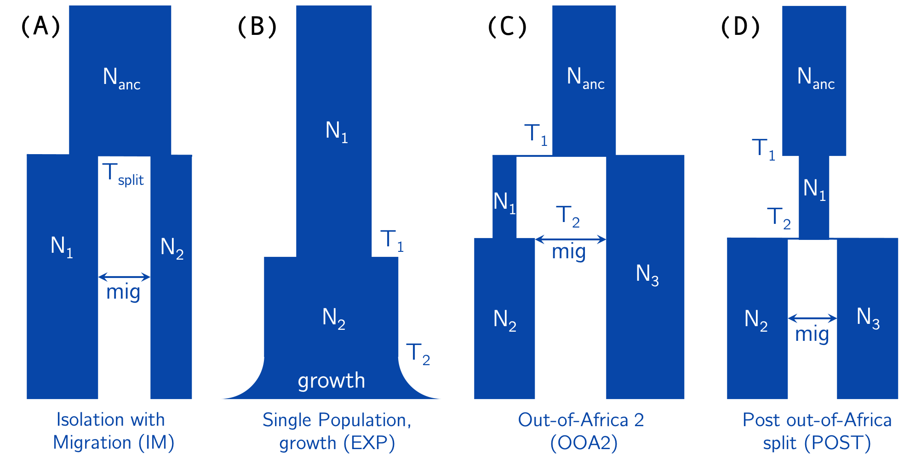
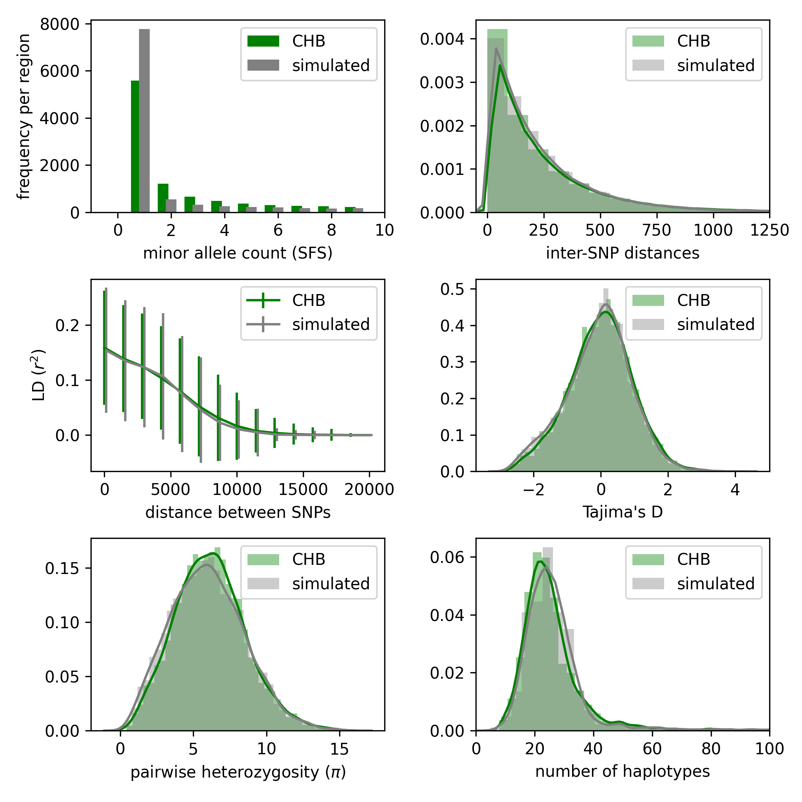

# pg-wgan

The software is an implementation of pg-gan with Wasserstien loss. Below are instructions and detatils of this implementation.

## Results

- Files named Experimentx.out, where x is 1-4, are the raw results of the 4 experiments described in the paper, paper.pdf. 
- Due to the large size of Experiment4.out, it is NOT included in this repo. Please download it from here https://drive.google.com/file/d/1f39YY65xBmQcXtoP6t6WBiBbSen6ZGz4/view?usp=sharing
- To reproduce those results, run the following command with x replaced with the experiment number:
`python3 graph.py Experimentx.out`
- Experiment 4 is the best experiment; it's the one with gradient penality, no weight clipping, only 5 critic epochs per generator iteration, and 20,000 iterations in total (20,000 simulated annealing steps and thus 100,000 critic epochs in total)
- Other experiments (1-3) are not salvagalbe; that is, there is no parameter choice that can make them work for the pg-gan dataset. This is mainly because of how deep the data is and the fact that the experiments use weight clipping, not gradient penality, which prevents the network from capturing more details, as the clipping happens very often, obscuring any information that can be gained from how large the gradient magnitude deviated from the norm.

## The current version

The file pg-wgan.py contatins the current working version of pg-wgan, which is the one that produced Experiment4.out. This version is set as follows:
- 10 proposals per parameter.
- 50 batch size.
- NO PRE-TRAINING.
- 5 Critic epochs per Simulated Annealing step.
- 20,000 Gereator iterations.

## Notes and Future Work:

- As it turns out, pre-training is not necessary at all in pg-wgan. In fact, in some experiments pre-training led to the critic having more control over the learning process and changing the sign it gives to data as it wishes (switching from scoring real data with a large positive and fake data with a large negative to the opposite and vice versa).
- Running the same experiment multiple times should produce similar results.
- Applying a layer normalization layer to the critic archeticture may speed up the entire learning process, but it most likely neither improves nor harms the results.

Please find the original pg-gan README below!

## pg-gan

This software can be used to create realistic simulated data that matches real
population genetic data. It implements a GAN-based algorithm (Generative Adversarial Network)
described in the pre-print [Automatic inference of demographic parameters using Generative Adversarial Networks](https://www.biorxiv.org/content/10.1101/2020.08.05.237834v1).

Python 3.6 (or later) is required, along with the following libraries (these exact versions are likely not necessary, but should be similar):

~~~
msprime==0.7.4
numpy==1.17.2
tensorflow==2.2.0
~~~

See the [msprime documentation](https://msprime.readthedocs.io/en/stable/index.html) and
[tensorflow pip guide](https://www.tensorflow.org/install/pip) for installation instructions.

Dependencies for pre-processing real data (not needed to try out the first two simulation command lines below):

~~~
h5py==2.10.0
~~~

Link: [HDF5 for Python](https://www.h5py.org/)

Dependencies for creating summary statistic plots:

~~~
allel==1.2.1
~~~

Link: [scikit-allel](https://scikit-allel.readthedocs.io/en/stable/)

### Demographic models

There are currently six demographic models implemented in `pg-gan` (see below for information about adding your own model). Use the `-m` flag
to specify the model (required parameter).

* CONST (command line `const`): constant population size (Ne)
* IM (command line `im`): isolation-with-migration (two-population model)
* EXP (command line `exp`): one-population exponential growth model
* OOA2 (command line `ooa2`): Out-of-Africa model with two populations (e.g. YRI/CEU or YRI/CHB)
* POST (command line `post_ooa`): post Out-of-Africa split with two populations (e.g. CEU/CHB)
* OOA3 (command line `ooa3`): three-population Out-of-Africa model (e.g. YRI/CEU/CHB), as specified in [Gutenkunst et al 2009](https://journals.plos.org/plosgenetics/article?id=10.1371/journal.pgen.1000695) and implemented in [stdpopsim](https://elifesciences.org/articles/54967).

See the diagram below for the parameters of IM, EXP, OOA2, and POST. Mutation (`mut`) and recombination (`reco`) can also be added to
the list of parameters to infer.

### Simulated training data

Below are two examples with *simulated* training data. In this case the training data is simulated under fixed parameter values (see the manuscript link above for details). Then `pg-gan` attempts to infer these "true" values.

Note that all output is printed to stdout, including current parameter estimates and GAN confusion. If you save this output to a file, it
can then be read in by the summary statistic visualization program.

1. Toy example with simulated training data. `-m im` means use the IM model (isolation-with-migration) and
`-p` is used to specify the parameters to infer (six here). `-t` is the "toy" flag, which will run the method without discriminator
pre-training and then for two iterations only. It should take about 5 min with a GPU.

~~~
python3 pg_gan.py -m im -p N1,N2,N_anc,T_split,reco,mig -t
~~~

  The last two lines of the output contain:

  * A list of all parameter sets throughout training. The last set is used as the final inference. For example in this case the parameters values are:
  [7.118372774235415e-08, 4762.012023755695, 12480.088492825884, 0.061209667268172285, 1614.4605003581084, 20970.075968181205], although yours will be different.

  * A list of all generator loss values throughout training. In this case I obtained [6.124907, 4.915148, 2.7859032] (loss at the beginning as well as the loss after the two iterations). This is good since the
  loss is decreasing as the generator starts to move toward more realistic parameters (although two iterations will not get very far).

2. Same example above but without the "toy" flag. This will take several hours to run (likely 5-6 with a GPU, more
    without one).

~~~
python3 pg_gan.py -m im -p N1,N2,N_anc,T_split,reco,mig
~~~

### Real training data

Below is a tutorial that explains how to run `pg-gan` on the 1000 Genomes data. Modifications may be needed for other data, but the process
should generally be similar.

Note: this tutorial will require [bcftools](http://samtools.github.io/bcftools/bcftools.html).

1. Download the Phase 3 `ALL` VCF files from the [1000 Genomes Project](https://www.internationalgenome.org/data) for chromosomes 1-22. Also download
the accessibility mask `20120824_strict_mask.bed`.

2. Identify a set of samples for the population of interest. Here we will use CHB, and a sample file is provided above in `prep_data/CHB_gan.txt`.
When using more than one population, make sure the samples are sorted by population (and currently equal numbers from each population are needed). Data from all populations eventually needs to end up in the same VCF file and then the same HDF5 file.

3. Create a list of VCF files to use as training data. Here we will use chromosomes 1-22 from CHB, and the list of files is provided in `prep_data/CHB_filelist.txt`.

4. Prepare the VCF files using `bcftools`. This will remove non-segregating sites and multi-allelic sites, as well as retain our desired samples and concatenate chromosomes 1-22 into one VCF file. To do all these operations, use the file `prep_data/prep_vcf.sh`.

~~~
sh prep_data/prep_vcf.sh
~~~

5. Convert this final VCF file into HDF5 format:

~~~
python3 vcf2hdf5.py -i CHB.phase3_shapeit2_mvncall_integrated_v5a.20130502.genotypes.vcf.gz -o CHB.phase3_shapeit2_mvncall_integrated_v5a.20130502.genotypes.h5
~~~

6. Finally, run `pg-gan` on the data using (for example) a 5-parameter exponential growth model.

~~~
python3 pg_gan.py -m exp -p N1,N2,growth,T1,T2 -d CHB.phase3_shapeit2_mvncall_integrated_v5a.20130502.genotypes.h5 -b 20120824_strict_mask.bed
~~~

Use `-r` (optional) to specify a folder with recombination map files for each chromosome (for example `-r genetic_map/`). This will cause the generator to sample from this recombination rate distribution when creating simulated data. See the start of file `genetic_map_GRCh37_chr1.txt` below for the
format of the recombination map files.

~~~
Chromosome      Position(bp)    Rate(cM/Mb)     Map(cM)
chr1    55550   2.981822        0.000000
chr1    82571   2.082414        0.080572
chr1    88169   2.081358        0.092229
chr1    254996  3.354927        0.439456
...
~~~

### Visualizing summary statistics

After running `pg-gan`, the resulting parameters can be used to simulate data, which can then be compared to the real data via summary statistics. For example, to reproduce (roughly) the figures below, run the following commands:

~~~
python3 pg_gan.py -m const -p Ne -d CHB.phase3_shapeit2_mvncall_integrated_v5a.20130502.genotypes.h5 -b 20120824_strict_mask.bed -r genetic_map/ > chb_const.out

python3 summary_stats.py chb_const.out chb_const.png -m const -p Ne -d CHB.phase3_shapeit2_mvncall_integrated_v5a.20130502.genotypes.h5 -b 20120824_strict_mask.bed -r genetic_map/
~~~

The second command with `summary_stats.py` generates a plot (similar to the one below). The input file is `chb_const.out` and the output file is `chb_const.png`, but the rest of the command line arguments are the same as `pg-gan`.

Here is another example with the EXP model instead of CONST:

~~~
python3 pg_gan.py -m exp -p N1,N2,growth,T1,T2 -d CHB.phase3_shapeit2_mvncall_integrated_v5a.20130502.genotypes.h5 -b 20120824_strict_mask.bed -r genetic_map/ > chb_exp.out

python3 summary_stats.py chb_exp.out chb_exp.png -m exp -p N1,N2,growth,T1,T2 -d CHB.phase3_shapeit2_mvncall_integrated_v5a.20130502.genotypes.h5 -b 20120824_strict_mask.bed -r genetic_map/
~~~

### Creating your own models

You can add your own demographic models to `pg-gan`, as long as they are implemented in `msprime`. Right now new models must be added as functions
to `simulation.py`. Each function should return an `msprime` tree sequence. Here is an example for the CONST model. The `params` should match
those in the `util.py` file (although more can be added as needed), and the `sample_sizes` should be a list of integers (with length matching the number
  of populations). The other parameters of the function can be ignored unless the user wants to customize them.

~~~
def simulate_const(params, sample_sizes, L, seed, prior=[], weights=[]):
    assert len(sample_sizes) == 1

    # sample reco or use value
    if prior != []:
        reco = draw_background_rate_from_prior(prior, weights)
    else:
        reco = params.reco.value

    # simulate data
    ts = msprime.simulate(sample_size=sum(sample_sizes), Ne=params.Ne.value, \
        length=L, mutation_rate=params.mut.value, recombination_rate=reco, \
        random_seed = seed)

    return ts
~~~

After adding this function, register it in the `process_opts` function of `pg_gan.py` as a new option. For one-population models use the `OnePopModel`
discriminator, for two-population models use `TwoPopModel`, and for three-population models use `ThreePopModel`. The `sample_sizes` variable
should be a list of integers matching the number of haplotypes in each population.

~~~
if opts.model == 'const':
    sample_sizes = [198]
    discriminator = discriminators.OnePopModel()
    simulator = simulation.simulate_const
~~~

### General notes

We recommend running `pg-gan` 10 times, then selecting the run with the lowest discriminator accuracy on *generated* data (i.e. which run produces data that is most easily confused for real data). If any runs result in a discriminator that always predicts the same class (either all real or all simulated), reject the run.

`pg-gan` is under active development. Please reach out to Sara Mathieson (smathieson [at] haverford [dot] edu) with any questions.
